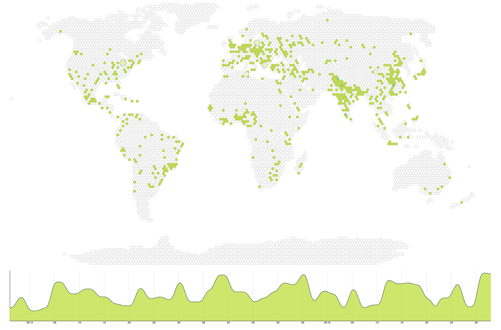

# Traffic-Visualization
Experiment using D3 / Service Workers

An attempt to create a live D3 visualization that would recieve push events from a remote server. The goal was to use a service worker as an abstraction for a live production environment. 

## Setup
- ```npm install```
- ```npm start```




## Observations

- Initally thought I could push data out at an interval from the service worker and have the page recieve these events, but i don't think that's possible. I fell back on the client polling a endpoint that would be intercepted by the Service Worker - [Stack Overflow](https://stackoverflow.com/questions/53178703/timer-with-notifications-using-service-worker)
- D3-Hexgrid is an amazing library. The only feature I would love to see would be allowing incremental updates (which is a feature requested by an upstream dependency: d3-hexbin) [Github](https://github.com/d3/d3-hexbin/issues/3)

## Links / Inspiration

- https://observablehq.com/@larsvers/hexgrid-maps-with-d3-hexgrid
- https://vimeo.com/11613517
- https://pusher.com/tutorials/live-graph-d3
- https://bl.ocks.org/larsvers/ec4f4c96941b0fa97869184ab9a9fb5b
- http://bl.ocks.org/phil-pedruco/7745589
- https://bl.ocks.org/cherdarchuk/822ba3ead00a0ffdbcfd4a144e763e31
- https://developer.mozilla.org/en-US/docs/Web/API/WorkerGlobalScope/importScripts
- http://bl.ocks.org/simenbrekken/6634070
- https://bl.ocks.org/boeric/6a83de20f780b42fadb9
- https://stackoverflow.com/questions/31730028/how-can-i-generate-a-random-sample-of-bin-counts-given-a-sequence-of-bin-probabi
- https://gist.github.com/jmilamwalters/02d34d419988b5bbc6a65f505e0cddb0#file-choose-functional-source-code-js
- https://stackoverflow.com/questions/37445495/binning-an-array-in-javascript-for-a-histogram
- https://stackoverflow.com/questions/30203362/how-to-generate-a-random-weighted-distribution-of-elements
- https://stackoverflow.com/questions/8435183/generate-a-weighted-random-number
- https://bl.ocks.org/bytesbysophie/952a1003dd188410e9c6262b68a65f9a
- https://bl.ocks.org/NGuernse/284749c905b592d8d9cf7927864c0ff5
